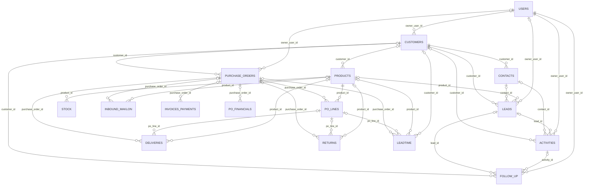

# DATABASE SCHEMA — PIK Marketing Control (Google Sheets)

> Dibuat otomatis dari `src/db/Schema.gs`, `src/db/Enums.gs`, dan `src/db/Settings.gs` dengan
> `npm run docs:schema`. Jangan diedit manual; `npm test` gagal bila dokumen ini tidak sesuai kode.

**Versi skema:** 3 · **Jumlah sheet:** 21

## 1. Konvensi

- **Satu sheet = satu tabel**, baris 1 = header (nama kolom `snake_case`), data mulai baris 2. Urutan sheet dan kolom
  adalah kontrak: kolom baru hanya ditambahkan di ujung kanan oleh `initializeDatabase()`; tidak pernah disisipkan,
  diganti nama, atau dihapus.
- **Tata letak kolom tabel data:** `id` → kolom bisnis → `is_active` → lineage (tabel hasil migrasi:
  `is_legacy`, `source_file`, `source_sheet`, `legacy_row`, `import_ref`, `migrated_at`, `migration_hash`) →
  `created_at`, `created_by`, `updated_at`, `updated_by` → kolom yang ditambahkan di versi skema berikutnya (urut versi).
- **ID stabil:** `PREFIX-XXXXXXXXXX` (10 digit heksadesimal huruf besar; `AUDIT_LOG` 16 digit). Format ini sama dengan
  ID workbook sehingga ID legacy dipakai apa adanya (D12). ID dibuat dari bit acak UUID, dicek terhadap ID yang sudah
  ada, tidak pernah berasal dari nomor baris, dan tidak dapat diubah.
- **Soft delete:** record tidak pernah dihapus permanen; arsip = `is_active` FALSE. Relasi baru tidak boleh menunjuk
  record yang diarsipkan; relasi lama tetap sah.
- **Data legacy:** `is_legacy` TRUE hanya dapat diisi oleh proses migrasi. Baris legacy divalidasi secara struktural
  (tipe, enum, relasi, keunikan); kolom "wajib (kecuali legacy)", batas angka, dan aturan tabel hanya berlaku untuk
  data baru (D3, D9). Kolom `*_legacy` menyimpan nilai asli sebagai referensi.
- **Audit:** setiap insert/update/arsip/pulihkan menulis `AUDIT_LOG` dalam lock yang sama; `created_by`/`updated_by`
  berisi email pelaku.
- **Nilai teks** di-trim; teks yang diawali `=` atau `'` ditolak (mencegah formula dan apostrof yang ditelan Sheets).

### Tipe data logis

| Tipe | Isi | Format sel Sheets |
|---|---|---|
| `id` | ID record, format PREFIX-XXXXXXXXXX (hex huruf besar) | `@` |
| `ref` | ID record tabel lain (relasi) | `@` |
| `string` | Teks satu baris | `@` |
| `text` | Teks panjang | `@` |
| `enum` | Nilai dari sheet ENUMS | `@` |
| `email` | Email huruf kecil | `@` |
| `url` | URL http(s) | `@` |
| `phone` | Nomor telepon sebagai teks | `@` |
| `date` | Tanggal, teks yyyy-MM-dd | `@` |
| `datetime` | Waktu, teks ISO 8601 UTC (…Z) | `@` |
| `time` | Jam, teks HH:mm | `@` |
| `integer` | Bilangan bulat | `0` |
| `quantity` | Kuantitas, maksimal 3 desimal | `#,##0.###` |
| `money` | Nilai uang (IDR), maksimal 2 desimal | `#,##0.00` |
| `decimal` | Angka desimal | `#,##0.######` |
| `boolean` | TRUE/FALSE (checkbox) | bawaan + checkbox |
| `json` | JSON sebagai teks | `@` |

## 2. Daftar sheet

| # | Sheet | Kelompok | Prefiks ID | Kolom | Keterangan |
|---:|---|---|---|---:|---|
| 1 | `README` | Dokumentasi | — | 2 | Panduan singkat struktur database. Dibuat ulang oleh initializeDatabase(). |
| 2 | `USERS` | Master | `USR-` | 14 | Pengguna aplikasi dan role-nya. Login memakai akun Google (Workspace) atau email + password; password hanya disimpan sebagai hash. |
| 3 | `CUSTOMERS` | Master | `CUS-` | 23 | Master customer. |
| 4 | `CONTACTS` | Master | `CON-` | 14 | Contact person per customer. Maksimal satu contact utama aktif per customer. |
| 5 | `PRODUCTS` | Master | `PRD-` | 22 | Master produk. Kode produk boleh sama di beberapa produk (duplikat legacy tidak digabung, D8). |
| 6 | `LEADS` | CRM | `LED-` | 19 | Pipeline peluang penjualan per customer. |
| 7 | `ACTIVITIES` | CRM | `ACT-` | 15 | Interaksi marketing dengan customer (WhatsApp, telepon, visit, dan lain-lain). |
| 8 | `FOLLOW_UP` | CRM | `FUP-` | 18 | Jadwal follow-up. Overdue dihitung saat dibaca (tanggal < hari ini dan status bukan DONE/CANCELLED), tidak disimpan (D14). |
| 9 | `PURCHASE_ORDERS` | Operasional | `PO-` | 24 | Header PO customer. Nomor PO unik per customer untuk PO yang tidak CANCELLED (D7). |
| 10 | `PO_LINES` | Operasional | `POL-` | 25 | Item per PO. Qty terkirim, retur, dan outstanding dihitung dari DELIVERIES dan RETURNS (tidak disimpan). |
| 11 | `DELIVERIES` | Operasional | `DEL-` | 24 | Transaksi pengiriman per surat jalan (SJ). Satu nomor SJ dapat memuat beberapa produk. |
| 12 | `RETURNS` | Operasional | `RET-` | 26 | Transaksi retur barang dari customer. |
| 13 | `STOCK` | Inventori | `STK-` | 24 | Catatan/snapshot stok per produk. |
| 14 | `LEADTIME` | Inventori | `LT-` | 25 | Jadwal pengiriman terencana per PO/produk (D10). Tidak dihitung sebagai qty terkirim. |
| 15 | `INBOUND_MAKLON` | Inventori | `INB-` | 32 | Penerimaan komponen di maklon. Kolom mengikuti sheet sumber yang diprofil di Phase 01. |
| 16 | `INVOICES_PAYMENTS` | Keuangan | `PAY-` | 28 | Satu baris per invoice beserta pembayarannya. Prefiks ID PAY- mengikuti workbook (D12). |
| 17 | `PO_FINANCIALS` | Keuangan | `POF-` | 31 | Ringkasan keuangan PO dari data legacy; referensi read-only (D11). Hanya proses migrasi yang menulis. |
| 18 | `MIGRATION_ISSUES` | Migrasi | `MIG-`, `PRF-` | 25 | Record legacy yang data/relasinya belum pasti. Diselesaikan Admin; relasi tidak pernah ditebak. |
| 19 | `ENUMS` | Sistem | — | 6 | Nilai pilihan (status, role, jenis). Label, urutan, dan nilai tambahan boleh dikelola Admin; nilai bawaan sistem tidak boleh dihapus atau dinonaktifkan. |
| 20 | `SETTINGS` | Sistem | — | 7 | Pengaturan aplikasi (key-value). Nilai disimpan sebagai teks dan dibaca sesuai value_type. |
| 21 | `AUDIT_LOG` | Sistem | `AUD-` | 9 | Jejak perubahan data, hanya ditambah (append-only). Ditulis otomatis oleh aplikasi. |

## 3. Relasi

| Tabel.kolom | Merujuk | Wajib | Konsistensi |
|---|---|---|---|
| `CUSTOMERS.owner_user_id` | `USERS.id` | opsional |  |
| `CONTACTS.customer_id` | `CUSTOMERS.id` | wajib |  |
| `PRODUCTS.customer_id` | `CUSTOMERS.id` | opsional |  |
| `LEADS.customer_id` | `CUSTOMERS.id` | wajib |  |
| `LEADS.contact_id` | `CONTACTS.id` | opsional | customer_id = CONTACTS.customer_id |
| `LEADS.product_id` | `PRODUCTS.id` | opsional |  |
| `LEADS.owner_user_id` | `USERS.id` | opsional |  |
| `ACTIVITIES.customer_id` | `CUSTOMERS.id` | opsional |  |
| `ACTIVITIES.contact_id` | `CONTACTS.id` | opsional | customer_id = CONTACTS.customer_id |
| `ACTIVITIES.lead_id` | `LEADS.id` | opsional | customer_id = LEADS.customer_id |
| `ACTIVITIES.owner_user_id` | `USERS.id` | wajib |  |
| `FOLLOW_UP.customer_id` | `CUSTOMERS.id` | opsional |  |
| `FOLLOW_UP.lead_id` | `LEADS.id` | opsional | customer_id = LEADS.customer_id |
| `FOLLOW_UP.activity_id` | `ACTIVITIES.id` | opsional | customer_id = ACTIVITIES.customer_id |
| `FOLLOW_UP.owner_user_id` | `USERS.id` | wajib |  |
| `PURCHASE_ORDERS.customer_id` | `CUSTOMERS.id` | wajib (kecuali legacy) |  |
| `PURCHASE_ORDERS.owner_user_id` | `USERS.id` | opsional |  |
| `PO_LINES.purchase_order_id` | `PURCHASE_ORDERS.id` | wajib |  |
| `PO_LINES.product_id` | `PRODUCTS.id` | wajib |  |
| `DELIVERIES.purchase_order_id` | `PURCHASE_ORDERS.id` | wajib (kecuali legacy) |  |
| `DELIVERIES.po_line_id` | `PO_LINES.id` | opsional | purchase_order_id = PO_LINES.purchase_order_id, product_id = PO_LINES.product_id |
| `DELIVERIES.product_id` | `PRODUCTS.id` | wajib (kecuali legacy) |  |
| `RETURNS.purchase_order_id` | `PURCHASE_ORDERS.id` | opsional |  |
| `RETURNS.po_line_id` | `PO_LINES.id` | opsional | purchase_order_id = PO_LINES.purchase_order_id, product_id = PO_LINES.product_id |
| `RETURNS.product_id` | `PRODUCTS.id` | wajib (kecuali legacy) |  |
| `STOCK.product_id` | `PRODUCTS.id` | wajib (kecuali legacy) |  |
| `LEADTIME.purchase_order_id` | `PURCHASE_ORDERS.id` | wajib (kecuali legacy) | customer_id = PURCHASE_ORDERS.customer_id |
| `LEADTIME.po_line_id` | `PO_LINES.id` | opsional | purchase_order_id = PO_LINES.purchase_order_id, product_id = PO_LINES.product_id |
| `LEADTIME.product_id` | `PRODUCTS.id` | wajib (kecuali legacy) |  |
| `LEADTIME.customer_id` | `CUSTOMERS.id` | opsional |  |
| `INBOUND_MAKLON.purchase_order_id` | `PURCHASE_ORDERS.id` | wajib (kecuali legacy) |  |
| `INBOUND_MAKLON.product_id` | `PRODUCTS.id` | opsional |  |
| `INVOICES_PAYMENTS.purchase_order_id` | `PURCHASE_ORDERS.id` | wajib (kecuali legacy) |  |
| `PO_FINANCIALS.purchase_order_id` | `PURCHASE_ORDERS.id` | opsional |  |

Aturan relasi: nilai relasi harus berformat ID tabel tujuan dan record tujuan harus ada (tidak ada record yatim).
Relasi baru atau yang diubah harus menunjuk record aktif (kecuali proses migrasi). Kolom konsistensi: bila relasi
diisi, nilai kolom lokal harus sama dengan nilai di record tujuan; pada data legacy, kolom lokal boleh kosong tetapi
tidak boleh bertentangan.

## 4. Kolom per sheet

Kolom "Ditulis oleh": *aplikasi* = input pengguna melalui layanan; *sistem* = diisi repository; *layanan server* =
hanya layanan internal; *migrasi* = hanya proses migrasi; *arsip/pulihkan* = hanya fungsi arsip/pulihkan (proses migrasi boleh menyalin nilai sumber).

### 4.1 `README` — README

Panduan singkat struktur database. Dibuat ulang oleh initializeDatabase().

dikelola sistem (bukan lewat repository umum)

| # | Kolom | Tipe | Wajib | Relasi / batasan | Default | Ditulis oleh | Catatan |
|---:|---|---|---|---|---|---|---|
| 1 | `key` | string | wajib | maks 100 karakter |  | aplikasi | Kunci. |
| 2 | `value` | text |  | maks 5000 karakter |  | aplikasi | Keterangan. |

### 4.2 `USERS` — User

Pengguna aplikasi dan role-nya. Login memakai akun Google (Workspace) atau email + password; password hanya disimpan sebagai hash.

ID: `USR-` · soft delete

| # | Kolom | Tipe | Wajib | Relasi / batasan | Default | Ditulis oleh | Catatan |
|---:|---|---|---|---|---|---|---|
| 1 | `id` | id | wajib | harus berformat USR-XXXXXXXXXX |  | sistem (otomatis) | ID. ID permanen; tidak pernah diubah dan bukan nomor baris. |
| 2 | `name` | string | wajib | maks 150 karakter |  | aplikasi | Nama. |
| 3 | `email` | email | wajib | maks 255 karakter |  | aplikasi | Email. |
| 4 | `role` | enum | wajib | enum USER_ROLE |  | aplikasi | Role. |
| 5 | `phone` | phone |  | maks 100 karakter |  | aplikasi | Telepon. |
| 6 | `last_login_at` | datetime |  |  |  | layanan server | Login terakhir. |
| 7 | `is_active` | boolean | wajib |  | `TRUE` | arsip/pulihkan | Aktif. FALSE = diarsipkan (soft delete). Data tidak dihapus permanen. |
| 8 | `created_at` | datetime | wajib |  |  | sistem (otomatis) | Dibuat pada. |
| 9 | `created_by` | string | wajib | maks 255 karakter |  | sistem (otomatis) | Dibuat oleh. |
| 10 | `updated_at` | datetime | wajib |  |  | sistem (otomatis) | Diubah pada. |
| 11 | `updated_by` | string | wajib | maks 255 karakter |  | sistem (otomatis) | Diubah oleh. |
| 12 | `password_hash` | string |  | maks 200 karakter |  | layanan server | Hash password. PBKDF2-SHA256 dengan salt, bukan password. Diisi server; tidak pernah dikirim ke browser atau audit log. Ditambahkan di skema v3. |
| 13 | `password_changed_at` | datetime |  |  |  | layanan server | Password diubah. Sesi login yang dibuat sebelum waktu ini tidak berlaku lagi. Ditambahkan di skema v3. |
| 14 | `must_change_password` | boolean |  |  |  | layanan server | Wajib ganti password. TRUE setelah Admin mengatur password sementara. Ditambahkan di skema v3. |

- **Unik:** email unik (tanpa membedakan huruf besar/kecil).

### 4.3 `CUSTOMERS` — Customer

Master customer.

ID: `CUS-` · soft delete · lineage migrasi

| # | Kolom | Tipe | Wajib | Relasi / batasan | Default | Ditulis oleh | Catatan |
|---:|---|---|---|---|---|---|---|
| 1 | `id` | id | wajib | harus berformat CUS-XXXXXXXXXX |  | sistem (otomatis) | ID. ID permanen; tidak pernah diubah dan bukan nomor baris. |
| 2 | `customer_code` | string |  | maks 100 karakter |  | aplikasi | Kode customer. |
| 3 | `name` | string | wajib | maks 255 karakter |  | aplikasi | Nama customer. |
| 4 | `industry` | string |  | maks 150 karakter |  | aplikasi | Industri. |
| 5 | `address` | text |  | maks 2000 karakter |  | aplikasi | Alamat. |
| 6 | `phone` | phone |  | maks 100 karakter |  | aplikasi | Telepon. |
| 7 | `email` | email |  | maks 255 karakter |  | aplikasi | Email. |
| 8 | `website` | url |  | maks 255 karakter |  | aplikasi | Website. |
| 9 | `status` | enum |  | enum CUSTOMER_STATUS |  | aplikasi | Status customer. |
| 10 | `owner_user_id` | ref |  | → USERS.id |  | aplikasi | PIC marketing. |
| 11 | `notes` | text |  | maks 5000 karakter |  | aplikasi | Catatan. |
| 12 | `is_active` | boolean | wajib |  | `TRUE` | arsip/pulihkan | Aktif. FALSE = diarsipkan (soft delete). Data tidak dihapus permanen. |
| 13 | `is_legacy` | boolean | wajib |  | `FALSE` | migrasi | Data legacy. TRUE untuk record hasil migrasi data legacy (D3). |
| 14 | `source_file` | string |  | maks 255 karakter |  | migrasi | File sumber legacy. |
| 15 | `source_sheet` | string |  | maks 100 karakter |  | migrasi | Sheet sumber legacy. |
| 16 | `legacy_row` | integer |  | ≥ 1 |  | migrasi | Baris sumber legacy. |
| 17 | `import_ref` | string |  | maks 255 karakter |  | migrasi | Referensi impor. Asal di workbook migrasi: <file>#<SHEET>!<baris>. |
| 18 | `migrated_at` | datetime |  |  |  | migrasi | Waktu migrasi. |
| 19 | `migration_hash` | string |  | maks 64 karakter |  | migrasi | Hash sumber migrasi. |
| 20 | `created_at` | datetime | wajib |  |  | sistem (otomatis) | Dibuat pada. |
| 21 | `created_by` | string | wajib | maks 255 karakter |  | sistem (otomatis) | Dibuat oleh. |
| 22 | `updated_at` | datetime | wajib |  |  | sistem (otomatis) | Diubah pada. |
| 23 | `updated_by` | string | wajib | maks 255 karakter |  | sistem (otomatis) | Diubah oleh. |

- **Unik:** customer_code unik bila diisi (tanpa membedakan huruf).

### 4.4 `CONTACTS` — Contact

Contact person per customer. Maksimal satu contact utama aktif per customer.

ID: `CON-` · soft delete

| # | Kolom | Tipe | Wajib | Relasi / batasan | Default | Ditulis oleh | Catatan |
|---:|---|---|---|---|---|---|---|
| 1 | `id` | id | wajib | harus berformat CON-XXXXXXXXXX |  | sistem (otomatis) | ID. ID permanen; tidak pernah diubah dan bukan nomor baris. |
| 2 | `customer_id` | ref | wajib | → CUSTOMERS.id |  | aplikasi | Customer. |
| 3 | `name` | string | wajib | maks 150 karakter |  | aplikasi | Nama contact. |
| 4 | `position` | string |  | maks 150 karakter |  | aplikasi | Jabatan. |
| 5 | `phone` | phone |  | maks 100 karakter |  | aplikasi | Telepon. |
| 6 | `email` | email |  | maks 255 karakter |  | aplikasi | Email. |
| 7 | `whatsapp` | phone |  | maks 100 karakter |  | aplikasi | WhatsApp. |
| 8 | `is_primary` | boolean | wajib |  | `FALSE` | aplikasi | Contact utama. |
| 9 | `notes` | text |  | maks 5000 karakter |  | aplikasi | Catatan. |
| 10 | `is_active` | boolean | wajib |  | `TRUE` | arsip/pulihkan | Aktif. FALSE = diarsipkan (soft delete). Data tidak dihapus permanen. |
| 11 | `created_at` | datetime | wajib |  |  | sistem (otomatis) | Dibuat pada. |
| 12 | `created_by` | string | wajib | maks 255 karakter |  | sistem (otomatis) | Dibuat oleh. |
| 13 | `updated_at` | datetime | wajib |  |  | sistem (otomatis) | Diubah pada. |
| 14 | `updated_by` | string | wajib | maks 255 karakter |  | sistem (otomatis) | Diubah oleh. |

- **Unik:** maksimal satu contact is_primary = TRUE yang aktif per customer_id.

### 4.5 `PRODUCTS` — Produk

Master produk. Kode produk boleh sama di beberapa produk (duplikat legacy tidak digabung, D8).

ID: `PRD-` · soft delete · lineage migrasi

| # | Kolom | Tipe | Wajib | Relasi / batasan | Default | Ditulis oleh | Catatan |
|---:|---|---|---|---|---|---|---|
| 1 | `id` | id | wajib | harus berformat PRD-XXXXXXXXXX |  | sistem (otomatis) | ID. ID permanen; tidak pernah diubah dan bukan nomor baris. |
| 2 | `product_code` | string |  | maks 100 karakter |  | aplikasi | Kode produk. |
| 3 | `product_code_key` | string |  | maks 100 karakter |  | sistem (otomatis) | Kunci kode produk. Otomatis: kode tanpa kurung/spasi, huruf besar; bila kode kosong diambil dari kode di awal nama. |
| 4 | `name` | string | wajib | maks 255 karakter |  | aplikasi | Nama produk. |
| 5 | `variant` | string |  | maks 255 karakter |  | aplikasi | Varian. |
| 6 | `category` | string |  | maks 150 karakter |  | aplikasi | Kategori. |
| 7 | `customer_id` | ref |  | → CUSTOMERS.id |  | aplikasi | Customer pemilik. Diisi bila produk khusus untuk satu customer. |
| 8 | `description` | text |  | maks 5000 karakter |  | aplikasi | Deskripsi. |
| 9 | `unit` | string | wajib | maks 50 karakter | `pcs` | aplikasi | Satuan. |
| 10 | `lead_time_days` | integer |  | ≥ 0 |  | aplikasi | Lead time (hari). |
| 11 | `is_active` | boolean | wajib |  | `TRUE` | arsip/pulihkan | Aktif. FALSE = diarsipkan (soft delete). Data tidak dihapus permanen. |
| 12 | `is_legacy` | boolean | wajib |  | `FALSE` | migrasi | Data legacy. TRUE untuk record hasil migrasi data legacy (D3). |
| 13 | `source_file` | string |  | maks 255 karakter |  | migrasi | File sumber legacy. |
| 14 | `source_sheet` | string |  | maks 100 karakter |  | migrasi | Sheet sumber legacy. |
| 15 | `legacy_row` | integer |  | ≥ 1 |  | migrasi | Baris sumber legacy. |
| 16 | `import_ref` | string |  | maks 255 karakter |  | migrasi | Referensi impor. Asal di workbook migrasi: <file>#<SHEET>!<baris>. |
| 17 | `migrated_at` | datetime |  |  |  | migrasi | Waktu migrasi. |
| 18 | `migration_hash` | string |  | maks 64 karakter |  | migrasi | Hash sumber migrasi. |
| 19 | `created_at` | datetime | wajib |  |  | sistem (otomatis) | Dibuat pada. |
| 20 | `created_by` | string | wajib | maks 255 karakter |  | sistem (otomatis) | Dibuat oleh. |
| 21 | `updated_at` | datetime | wajib |  |  | sistem (otomatis) | Diubah pada. |
| 22 | `updated_by` | string | wajib | maks 255 karakter |  | sistem (otomatis) | Diubah oleh. |

### 4.6 `LEADS` — Lead

Pipeline peluang penjualan per customer.

ID: `LED-` · soft delete

| # | Kolom | Tipe | Wajib | Relasi / batasan | Default | Ditulis oleh | Catatan |
|---:|---|---|---|---|---|---|---|
| 1 | `id` | id | wajib | harus berformat LED-XXXXXXXXXX |  | sistem (otomatis) | ID. ID permanen; tidak pernah diubah dan bukan nomor baris. |
| 2 | `customer_id` | ref | wajib | → CUSTOMERS.id |  | aplikasi | Customer. |
| 3 | `contact_id` | ref |  | → CONTACTS.id |  | aplikasi | Contact. |
| 4 | `product_id` | ref |  | → PRODUCTS.id |  | aplikasi | Produk. |
| 5 | `name` | string | wajib | maks 255 karakter |  | aplikasi | Nama lead. |
| 6 | `source` | string |  | maks 100 karakter |  | aplikasi | Sumber lead. |
| 7 | `product_interest` | string |  | maks 255 karakter |  | aplikasi | Minat produk. |
| 8 | `estimated_quantity` | quantity |  | ≥ 0 |  | aplikasi | Estimasi kuantitas. |
| 9 | `estimated_value` | money |  | ≥ 0 |  | aplikasi | Estimasi nilai. |
| 10 | `status` | enum | wajib | enum LEAD_STATUS | `NEW` | aplikasi | Status lead. |
| 11 | `priority` | enum |  | enum PRIORITY |  | aplikasi | Prioritas. |
| 12 | `owner_user_id` | ref |  | → USERS.id |  | aplikasi | PIC. |
| 13 | `expected_closing_date` | date |  |  |  | aplikasi | Perkiraan closing. |
| 14 | `notes` | text |  | maks 5000 karakter |  | aplikasi | Catatan. |
| 15 | `is_active` | boolean | wajib |  | `TRUE` | arsip/pulihkan | Aktif. FALSE = diarsipkan (soft delete). Data tidak dihapus permanen. |
| 16 | `created_at` | datetime | wajib |  |  | sistem (otomatis) | Dibuat pada. |
| 17 | `created_by` | string | wajib | maks 255 karakter |  | sistem (otomatis) | Dibuat oleh. |
| 18 | `updated_at` | datetime | wajib |  |  | sistem (otomatis) | Diubah pada. |
| 19 | `updated_by` | string | wajib | maks 255 karakter |  | sistem (otomatis) | Diubah oleh. |

### 4.7 `ACTIVITIES` — Aktivitas

Interaksi marketing dengan customer (WhatsApp, telepon, visit, dan lain-lain).

ID: `ACT-` · soft delete

| # | Kolom | Tipe | Wajib | Relasi / batasan | Default | Ditulis oleh | Catatan |
|---:|---|---|---|---|---|---|---|
| 1 | `id` | id | wajib | harus berformat ACT-XXXXXXXXXX |  | sistem (otomatis) | ID. ID permanen; tidak pernah diubah dan bukan nomor baris. |
| 2 | `customer_id` | ref |  | → CUSTOMERS.id |  | aplikasi | Customer. |
| 3 | `contact_id` | ref |  | → CONTACTS.id |  | aplikasi | Contact. |
| 4 | `lead_id` | ref |  | → LEADS.id |  | aplikasi | Lead. |
| 5 | `type` | enum | wajib | enum ACTIVITY_TYPE |  | aplikasi | Jenis aktivitas. |
| 6 | `subject` | string | wajib | maks 255 karakter |  | aplikasi | Subjek. |
| 7 | `description` | text |  | maks 5000 karakter |  | aplikasi | Deskripsi. |
| 8 | `owner_user_id` | ref | wajib | → USERS.id |  | aplikasi | PIC. |
| 9 | `activity_at` | datetime | wajib |  |  | aplikasi | Waktu aktivitas. |
| 10 | `attachment_url` | url |  | maks 2000 karakter |  | aplikasi | Lampiran. |
| 11 | `is_active` | boolean | wajib |  | `TRUE` | arsip/pulihkan | Aktif. FALSE = diarsipkan (soft delete). Data tidak dihapus permanen. |
| 12 | `created_at` | datetime | wajib |  |  | sistem (otomatis) | Dibuat pada. |
| 13 | `created_by` | string | wajib | maks 255 karakter |  | sistem (otomatis) | Dibuat oleh. |
| 14 | `updated_at` | datetime | wajib |  |  | sistem (otomatis) | Diubah pada. |
| 15 | `updated_by` | string | wajib | maks 255 karakter |  | sistem (otomatis) | Diubah oleh. |

### 4.8 `FOLLOW_UP` — Follow-up

Jadwal follow-up. Overdue dihitung saat dibaca (tanggal < hari ini dan status bukan DONE/CANCELLED), tidak disimpan (D14).

ID: `FUP-` · soft delete

| # | Kolom | Tipe | Wajib | Relasi / batasan | Default | Ditulis oleh | Catatan |
|---:|---|---|---|---|---|---|---|
| 1 | `id` | id | wajib | harus berformat FUP-XXXXXXXXXX |  | sistem (otomatis) | ID. ID permanen; tidak pernah diubah dan bukan nomor baris. |
| 2 | `customer_id` | ref |  | → CUSTOMERS.id |  | aplikasi | Customer. |
| 3 | `lead_id` | ref |  | → LEADS.id |  | aplikasi | Lead. |
| 4 | `activity_id` | ref |  | → ACTIVITIES.id |  | aplikasi | Aktivitas asal. |
| 5 | `owner_user_id` | ref | wajib | → USERS.id |  | aplikasi | PIC. |
| 6 | `follow_up_date` | date | wajib |  |  | aplikasi | Tanggal follow-up. |
| 7 | `follow_up_time` | time |  |  |  | aplikasi | Jam follow-up. |
| 8 | `type` | enum |  | enum ACTIVITY_TYPE |  | aplikasi | Jenis follow-up. |
| 9 | `purpose` | string |  | maks 255 karakter |  | aplikasi | Tujuan. |
| 10 | `priority` | enum |  | enum PRIORITY |  | aplikasi | Prioritas. |
| 11 | `status` | enum | wajib | enum FOLLOW_UP_STATUS | `PLANNED` | aplikasi | Status. |
| 12 | `result` | text |  | maks 5000 karakter |  | aplikasi | Hasil. |
| 13 | `notes` | text |  | maks 5000 karakter |  | aplikasi | Catatan. |
| 14 | `is_active` | boolean | wajib |  | `TRUE` | arsip/pulihkan | Aktif. FALSE = diarsipkan (soft delete). Data tidak dihapus permanen. |
| 15 | `created_at` | datetime | wajib |  |  | sistem (otomatis) | Dibuat pada. |
| 16 | `created_by` | string | wajib | maks 255 karakter |  | sistem (otomatis) | Dibuat oleh. |
| 17 | `updated_at` | datetime | wajib |  |  | sistem (otomatis) | Diubah pada. |
| 18 | `updated_by` | string | wajib | maks 255 karakter |  | sistem (otomatis) | Diubah oleh. |

### 4.9 `PURCHASE_ORDERS` — Purchase order

Header PO customer. Nomor PO unik per customer untuk PO yang tidak CANCELLED (D7).

ID: `PO-` · soft delete · lineage migrasi

| # | Kolom | Tipe | Wajib | Relasi / batasan | Default | Ditulis oleh | Catatan |
|---:|---|---|---|---|---|---|---|
| 1 | `id` | id | wajib | harus berformat PO-XXXXXXXXXX |  | sistem (otomatis) | ID. ID permanen; tidak pernah diubah dan bukan nomor baris. |
| 2 | `po_number` | string | wajib (kecuali legacy) | maks 150 karakter |  | aplikasi | Nomor PO. |
| 3 | `po_number_key` | string |  | maks 150 karakter |  | sistem (otomatis) | Kunci nomor PO. Otomatis dari po_number: tanpa spasi, huruf besar. Untuk pencarian dan keunikan. |
| 4 | `customer_id` | ref | wajib (kecuali legacy) | → CUSTOMERS.id |  | aplikasi | Customer. |
| 5 | `po_date` | date | wajib (kecuali legacy) |  |  | aplikasi | Tanggal PO. |
| 6 | `expected_delivery_date` | date |  |  |  | aplikasi | Target kirim. |
| 7 | `status` | enum | wajib | enum PO_STATUS | `OPEN` | aplikasi | Status PO. |
| 8 | `payment_term` | string |  | maks 100 karakter |  | aplikasi | Termin pembayaran. |
| 9 | `owner_user_id` | ref |  | → USERS.id |  | aplikasi | PIC. |
| 10 | `notes` | text |  | maks 5000 karakter |  | aplikasi | Catatan. |
| 11 | `po_number_legacy` | string |  | maks 255 karakter |  | migrasi | Nomor PO legacy. Nilai asli data legacy apa adanya, hanya referensi. |
| 12 | `status_legacy` | string |  | maks 100 karakter |  | migrasi | Status PO legacy. Nilai asli data legacy apa adanya, hanya referensi. |
| 13 | `is_active` | boolean | wajib |  | `TRUE` | arsip/pulihkan | Aktif. FALSE = diarsipkan (soft delete). Data tidak dihapus permanen. |
| 14 | `is_legacy` | boolean | wajib |  | `FALSE` | migrasi | Data legacy. TRUE untuk record hasil migrasi data legacy (D3). |
| 15 | `source_file` | string |  | maks 255 karakter |  | migrasi | File sumber legacy. |
| 16 | `source_sheet` | string |  | maks 100 karakter |  | migrasi | Sheet sumber legacy. |
| 17 | `legacy_row` | integer |  | ≥ 1 |  | migrasi | Baris sumber legacy. |
| 18 | `import_ref` | string |  | maks 255 karakter |  | migrasi | Referensi impor. Asal di workbook migrasi: <file>#<SHEET>!<baris>. |
| 19 | `migrated_at` | datetime |  |  |  | migrasi | Waktu migrasi. |
| 20 | `migration_hash` | string |  | maks 64 karakter |  | migrasi | Hash sumber migrasi. |
| 21 | `created_at` | datetime | wajib |  |  | sistem (otomatis) | Dibuat pada. |
| 22 | `created_by` | string | wajib | maks 255 karakter |  | sistem (otomatis) | Dibuat oleh. |
| 23 | `updated_at` | datetime | wajib |  |  | sistem (otomatis) | Diubah pada. |
| 24 | `updated_by` | string | wajib | maks 255 karakter |  | sistem (otomatis) | Diubah oleh. |

- **Unik:** (customer_id, po_number_key) unik untuk PO yang tidak CANCELLED; PO tanpa nomor/customer tidak dihitung. Nomor ganda yang sudah ada di data legacy diterima dan dicatat di MIGRATION_ISSUES (D7), tetapi PO baru tidak boleh memakai nomor yang sama.
- **Aturan (data baru):** expected_delivery_date tidak boleh sebelum po_date.

### 4.10 `PO_LINES` — Baris PO

Item per PO. Qty terkirim, retur, dan outstanding dihitung dari DELIVERIES dan RETURNS (tidak disimpan).

ID: `POL-` · soft delete · lineage migrasi

| # | Kolom | Tipe | Wajib | Relasi / batasan | Default | Ditulis oleh | Catatan |
|---:|---|---|---|---|---|---|---|
| 1 | `id` | id | wajib | harus berformat POL-XXXXXXXXXX |  | sistem (otomatis) | ID. ID permanen; tidak pernah diubah dan bukan nomor baris. |
| 2 | `purchase_order_id` | ref | wajib | → PURCHASE_ORDERS.id |  | aplikasi | PO. |
| 3 | `product_id` | ref | wajib | → PRODUCTS.id |  | aplikasi | Produk. |
| 4 | `order_quantity` | quantity | wajib | > 0 |  | aplikasi | Qty order. |
| 5 | `unit` | string |  | maks 50 karakter |  | aplikasi | Satuan. |
| 6 | `unit_price` | money |  | ≥ 0 |  | aplikasi | Harga satuan. |
| 7 | `notes` | text |  | maks 5000 karakter |  | aplikasi | Catatan. |
| 8 | `product_name_legacy` | string |  | maks 255 karakter |  | migrasi | Nama produk legacy. Nilai asli data legacy apa adanya, hanya referensi. |
| 9 | `variant_legacy` | string |  | maks 255 karakter |  | migrasi | Varian legacy. Nilai asli data legacy apa adanya, hanya referensi. |
| 10 | `delivered_qty_legacy` | quantity |  |  |  | migrasi | Qty terkirim legacy. Nilai asli data legacy apa adanya, hanya referensi. |
| 11 | `returned_qty_legacy` | quantity |  |  |  | migrasi | Qty retur legacy. Nilai asli data legacy apa adanya, hanya referensi. |
| 12 | `outstanding_qty_legacy` | quantity |  |  |  | migrasi | Outstanding legacy. Nilai asli data legacy apa adanya, hanya referensi. |
| 13 | `status_legacy` | string |  | maks 100 karakter |  | migrasi | Status legacy. Nilai asli data legacy apa adanya, hanya referensi. |
| 14 | `is_active` | boolean | wajib |  | `TRUE` | arsip/pulihkan | Aktif. FALSE = diarsipkan (soft delete). Data tidak dihapus permanen. |
| 15 | `is_legacy` | boolean | wajib |  | `FALSE` | migrasi | Data legacy. TRUE untuk record hasil migrasi data legacy (D3). |
| 16 | `source_file` | string |  | maks 255 karakter |  | migrasi | File sumber legacy. |
| 17 | `source_sheet` | string |  | maks 100 karakter |  | migrasi | Sheet sumber legacy. |
| 18 | `legacy_row` | integer |  | ≥ 1 |  | migrasi | Baris sumber legacy. |
| 19 | `import_ref` | string |  | maks 255 karakter |  | migrasi | Referensi impor. Asal di workbook migrasi: <file>#<SHEET>!<baris>. |
| 20 | `migrated_at` | datetime |  |  |  | migrasi | Waktu migrasi. |
| 21 | `migration_hash` | string |  | maks 64 karakter |  | migrasi | Hash sumber migrasi. |
| 22 | `created_at` | datetime | wajib |  |  | sistem (otomatis) | Dibuat pada. |
| 23 | `created_by` | string | wajib | maks 255 karakter |  | sistem (otomatis) | Dibuat oleh. |
| 24 | `updated_at` | datetime | wajib |  |  | sistem (otomatis) | Diubah pada. |
| 25 | `updated_by` | string | wajib | maks 255 karakter |  | sistem (otomatis) | Diubah oleh. |

### 4.11 `DELIVERIES` — Delivery

Transaksi pengiriman per surat jalan (SJ). Satu nomor SJ dapat memuat beberapa produk.

ID: `DEL-` · soft delete · lineage migrasi

| # | Kolom | Tipe | Wajib | Relasi / batasan | Default | Ditulis oleh | Catatan |
|---:|---|---|---|---|---|---|---|
| 1 | `id` | id | wajib | harus berformat DEL-XXXXXXXXXX |  | sistem (otomatis) | ID. ID permanen; tidak pernah diubah dan bukan nomor baris. |
| 2 | `purchase_order_id` | ref | wajib (kecuali legacy) | → PURCHASE_ORDERS.id |  | aplikasi | PO. |
| 3 | `po_line_id` | ref |  | → PO_LINES.id |  | aplikasi | Baris PO. |
| 4 | `product_id` | ref | wajib (kecuali legacy) | → PRODUCTS.id |  | aplikasi | Produk. |
| 5 | `delivery_date` | date | wajib (kecuali legacy) |  |  | aplikasi | Tanggal kirim. |
| 6 | `quantity` | quantity | wajib (kecuali legacy) | > 0 |  | aplikasi | Qty kirim. Data legacy boleh negatif (koreksi, D9). |
| 7 | `status` | enum |  | enum DELIVERY_STATUS |  | aplikasi | Status delivery. |
| 8 | `sj_number` | string |  | maks 100 karakter |  | aplikasi | Nomor SJ. |
| 9 | `sj_number_key` | string |  | maks 150 karakter |  | sistem (otomatis) | Kunci nomor SJ. Otomatis dari sj_number: tanpa spasi, huruf besar. Untuk pencarian dan keunikan. |
| 10 | `destination` | string |  | maks 255 karakter |  | aplikasi | Tujuan kirim. |
| 11 | `attachment_url` | url |  | maks 2000 karakter |  | aplikasi | Lampiran. |
| 12 | `notes` | text |  | maks 5000 karakter |  | aplikasi | Catatan. |
| 13 | `is_active` | boolean | wajib |  | `TRUE` | arsip/pulihkan | Aktif. FALSE = diarsipkan (soft delete). Data tidak dihapus permanen. |
| 14 | `is_legacy` | boolean | wajib |  | `FALSE` | migrasi | Data legacy. TRUE untuk record hasil migrasi data legacy (D3). |
| 15 | `source_file` | string |  | maks 255 karakter |  | migrasi | File sumber legacy. |
| 16 | `source_sheet` | string |  | maks 100 karakter |  | migrasi | Sheet sumber legacy. |
| 17 | `legacy_row` | integer |  | ≥ 1 |  | migrasi | Baris sumber legacy. |
| 18 | `import_ref` | string |  | maks 255 karakter |  | migrasi | Referensi impor. Asal di workbook migrasi: <file>#<SHEET>!<baris>. |
| 19 | `migrated_at` | datetime |  |  |  | migrasi | Waktu migrasi. |
| 20 | `migration_hash` | string |  | maks 64 karakter |  | migrasi | Hash sumber migrasi. |
| 21 | `created_at` | datetime | wajib |  |  | sistem (otomatis) | Dibuat pada. |
| 22 | `created_by` | string | wajib | maks 255 karakter |  | sistem (otomatis) | Dibuat oleh. |
| 23 | `updated_at` | datetime | wajib |  |  | sistem (otomatis) | Diubah pada. |
| 24 | `updated_by` | string | wajib | maks 255 karakter |  | sistem (otomatis) | Diubah oleh. |

### 4.12 `RETURNS` — Retur

Transaksi retur barang dari customer.

ID: `RET-` · soft delete · lineage migrasi

| # | Kolom | Tipe | Wajib | Relasi / batasan | Default | Ditulis oleh | Catatan |
|---:|---|---|---|---|---|---|---|
| 1 | `id` | id | wajib | harus berformat RET-XXXXXXXXXX |  | sistem (otomatis) | ID. ID permanen; tidak pernah diubah dan bukan nomor baris. |
| 2 | `purchase_order_id` | ref |  | → PURCHASE_ORDERS.id |  | aplikasi | PO. |
| 3 | `po_line_id` | ref |  | → PO_LINES.id |  | aplikasi | Baris PO. |
| 4 | `product_id` | ref | wajib (kecuali legacy) | → PRODUCTS.id |  | aplikasi | Produk. |
| 5 | `return_date` | date | wajib (kecuali legacy) |  |  | aplikasi | Tanggal retur. |
| 6 | `quantity` | quantity | wajib | > 0 |  | aplikasi | Qty retur. |
| 7 | `reason` | text |  | maks 5000 karakter |  | aplikasi | Alasan retur. |
| 8 | `status` | enum |  | enum RETURN_STATUS |  | aplikasi | Status retur. |
| 9 | `sj_number` | string |  | maks 100 karakter |  | aplikasi | Nomor SJ. |
| 10 | `destination` | string |  | maks 255 karakter |  | aplikasi | Tujuan. |
| 11 | `attachment_url` | url |  | maks 2000 karakter |  | aplikasi | Lampiran. |
| 12 | `notes` | text |  | maks 5000 karakter |  | aplikasi | Catatan. |
| 13 | `po_number_legacy` | string |  | maks 255 karakter |  | migrasi | Nomor PO legacy. Nilai asli data legacy apa adanya, hanya referensi. |
| 14 | `product_legacy` | string |  | maks 255 karakter |  | migrasi | Produk legacy. Nilai asli data legacy apa adanya, hanya referensi. |
| 15 | `is_active` | boolean | wajib |  | `TRUE` | arsip/pulihkan | Aktif. FALSE = diarsipkan (soft delete). Data tidak dihapus permanen. |
| 16 | `is_legacy` | boolean | wajib |  | `FALSE` | migrasi | Data legacy. TRUE untuk record hasil migrasi data legacy (D3). |
| 17 | `source_file` | string |  | maks 255 karakter |  | migrasi | File sumber legacy. |
| 18 | `source_sheet` | string |  | maks 100 karakter |  | migrasi | Sheet sumber legacy. |
| 19 | `legacy_row` | integer |  | ≥ 1 |  | migrasi | Baris sumber legacy. |
| 20 | `import_ref` | string |  | maks 255 karakter |  | migrasi | Referensi impor. Asal di workbook migrasi: <file>#<SHEET>!<baris>. |
| 21 | `migrated_at` | datetime |  |  |  | migrasi | Waktu migrasi. |
| 22 | `migration_hash` | string |  | maks 64 karakter |  | migrasi | Hash sumber migrasi. |
| 23 | `created_at` | datetime | wajib |  |  | sistem (otomatis) | Dibuat pada. |
| 24 | `created_by` | string | wajib | maks 255 karakter |  | sistem (otomatis) | Dibuat oleh. |
| 25 | `updated_at` | datetime | wajib |  |  | sistem (otomatis) | Diubah pada. |
| 26 | `updated_by` | string | wajib | maks 255 karakter |  | sistem (otomatis) | Diubah oleh. |

### 4.13 `STOCK` — Stok

Catatan/snapshot stok per produk.

ID: `STK-` · soft delete · lineage migrasi

| # | Kolom | Tipe | Wajib | Relasi / batasan | Default | Ditulis oleh | Catatan |
|---:|---|---|---|---|---|---|---|
| 1 | `id` | id | wajib | harus berformat STK-XXXXXXXXXX |  | sistem (otomatis) | ID. ID permanen; tidak pernah diubah dan bukan nomor baris. |
| 2 | `product_id` | ref | wajib (kecuali legacy) | → PRODUCTS.id |  | aplikasi | Produk. |
| 3 | `stock_type` | enum | wajib | enum STOCK_TYPE |  | aplikasi | Jenis stok. |
| 4 | `status` | enum |  | enum STOCK_STATUS |  | aplikasi | Status stok. |
| 5 | `quantity` | quantity | wajib (kecuali legacy) | ≥ 0 |  | aplikasi | Qty. |
| 6 | `box_count` | quantity |  | ≥ 0 |  | aplikasi | Jumlah box. |
| 7 | `qty_per_box` | quantity |  | ≥ 0 |  | aplikasi | Qty per box. |
| 8 | `warehouse` | string |  | maks 150 karakter |  | aplikasi | Gudang. |
| 9 | `stock_date` | date | wajib (kecuali legacy) |  |  | aplikasi | Tanggal stok. |
| 10 | `notes` | text |  | maks 5000 karakter |  | aplikasi | Catatan. |
| 11 | `product_legacy` | string |  | maks 255 karakter |  | migrasi | Produk legacy. Nilai asli data legacy apa adanya, hanya referensi. |
| 12 | `status_legacy` | string |  | maks 100 karakter |  | migrasi | Status legacy. Nilai asli data legacy apa adanya, hanya referensi. |
| 13 | `is_active` | boolean | wajib |  | `TRUE` | arsip/pulihkan | Aktif. FALSE = diarsipkan (soft delete). Data tidak dihapus permanen. |
| 14 | `is_legacy` | boolean | wajib |  | `FALSE` | migrasi | Data legacy. TRUE untuk record hasil migrasi data legacy (D3). |
| 15 | `source_file` | string |  | maks 255 karakter |  | migrasi | File sumber legacy. |
| 16 | `source_sheet` | string |  | maks 100 karakter |  | migrasi | Sheet sumber legacy. |
| 17 | `legacy_row` | integer |  | ≥ 1 |  | migrasi | Baris sumber legacy. |
| 18 | `import_ref` | string |  | maks 255 karakter |  | migrasi | Referensi impor. Asal di workbook migrasi: <file>#<SHEET>!<baris>. |
| 19 | `migrated_at` | datetime |  |  |  | migrasi | Waktu migrasi. |
| 20 | `migration_hash` | string |  | maks 64 karakter |  | migrasi | Hash sumber migrasi. |
| 21 | `created_at` | datetime | wajib |  |  | sistem (otomatis) | Dibuat pada. |
| 22 | `created_by` | string | wajib | maks 255 karakter |  | sistem (otomatis) | Dibuat oleh. |
| 23 | `updated_at` | datetime | wajib |  |  | sistem (otomatis) | Diubah pada. |
| 24 | `updated_by` | string | wajib | maks 255 karakter |  | sistem (otomatis) | Diubah oleh. |

### 4.14 `LEADTIME` — Jadwal lead time

Jadwal pengiriman terencana per PO/produk (D10). Tidak dihitung sebagai qty terkirim.

ID: `LT-` · soft delete · lineage migrasi

| # | Kolom | Tipe | Wajib | Relasi / batasan | Default | Ditulis oleh | Catatan |
|---:|---|---|---|---|---|---|---|
| 1 | `id` | id | wajib | harus berformat LT-XXXXXXXXXX |  | sistem (otomatis) | ID. ID permanen; tidak pernah diubah dan bukan nomor baris. |
| 2 | `purchase_order_id` | ref | wajib (kecuali legacy) | → PURCHASE_ORDERS.id |  | aplikasi | PO. |
| 3 | `po_line_id` | ref |  | → PO_LINES.id |  | aplikasi | Baris PO. |
| 4 | `product_id` | ref | wajib (kecuali legacy) | → PRODUCTS.id |  | aplikasi | Produk. |
| 5 | `customer_id` | ref |  | → CUSTOMERS.id |  | aplikasi | Customer. |
| 6 | `planned_date` | date | wajib (kecuali legacy) |  |  | aplikasi | Tanggal rencana kirim. |
| 7 | `quantity` | quantity | wajib (kecuali legacy) | > 0 |  | aplikasi | Qty rencana. |
| 8 | `status` | enum |  | enum DELIVERY_STATUS |  | aplikasi | Status. |
| 9 | `lead_time_days` | integer |  | ≥ 0 |  | aplikasi | Lead time (hari). |
| 10 | `notes` | text |  | maks 5000 karakter |  | aplikasi | Catatan. |
| 11 | `po_number_legacy` | string |  | maks 255 karakter |  | migrasi | Nomor PO legacy. Nilai asli data legacy apa adanya, hanya referensi. |
| 12 | `product_legacy` | string |  | maks 255 karakter |  | migrasi | Produk legacy. Nilai asli data legacy apa adanya, hanya referensi. |
| 13 | `is_active` | boolean | wajib |  | `TRUE` | arsip/pulihkan | Aktif. FALSE = diarsipkan (soft delete). Data tidak dihapus permanen. |
| 14 | `is_legacy` | boolean | wajib |  | `FALSE` | migrasi | Data legacy. TRUE untuk record hasil migrasi data legacy (D3). |
| 15 | `source_file` | string |  | maks 255 karakter |  | migrasi | File sumber legacy. |
| 16 | `source_sheet` | string |  | maks 100 karakter |  | migrasi | Sheet sumber legacy. |
| 17 | `legacy_row` | integer |  | ≥ 1 |  | migrasi | Baris sumber legacy. |
| 18 | `import_ref` | string |  | maks 255 karakter |  | migrasi | Referensi impor. Asal di workbook migrasi: <file>#<SHEET>!<baris>. |
| 19 | `migrated_at` | datetime |  |  |  | migrasi | Waktu migrasi. |
| 20 | `migration_hash` | string |  | maks 64 karakter |  | migrasi | Hash sumber migrasi. |
| 21 | `created_at` | datetime | wajib |  |  | sistem (otomatis) | Dibuat pada. |
| 22 | `created_by` | string | wajib | maks 255 karakter |  | sistem (otomatis) | Dibuat oleh. |
| 23 | `updated_at` | datetime | wajib |  |  | sistem (otomatis) | Diubah pada. |
| 24 | `updated_by` | string | wajib | maks 255 karakter |  | sistem (otomatis) | Diubah oleh. |
| 25 | `status_legacy` | string |  | maks 100 karakter |  | migrasi | Status legacy. Nilai asli data legacy apa adanya, hanya referensi. Ditambahkan di skema v2. |

### 4.15 `INBOUND_MAKLON` — Inbound maklon

Penerimaan komponen di maklon. Kolom mengikuti sheet sumber yang diprofil di Phase 01.

ID: `INB-` · soft delete · lineage migrasi

| # | Kolom | Tipe | Wajib | Relasi / batasan | Default | Ditulis oleh | Catatan |
|---:|---|---|---|---|---|---|---|
| 1 | `id` | id | wajib | harus berformat INB-XXXXXXXXXX |  | sistem (otomatis) | ID. ID permanen; tidak pernah diubah dan bukan nomor baris. |
| 2 | `purchase_order_id` | ref | wajib (kecuali legacy) | → PURCHASE_ORDERS.id |  | aplikasi | PO. |
| 3 | `product_id` | ref |  | → PRODUCTS.id |  | aplikasi | Produk. |
| 4 | `vendor` | string |  | maks 150 karakter |  | aplikasi | Vendor. |
| 5 | `receiver` | string |  | maks 150 karakter |  | aplikasi | Penerima. |
| 6 | `inbound_date` | date | wajib |  |  | aplikasi | Tanggal masuk. |
| 7 | `sj_date` | date |  |  |  | aplikasi | Tanggal SJ. |
| 8 | `sj_number` | string |  | maks 100 karakter |  | aplikasi | Nomor SJ. |
| 9 | `sj_number_key` | string |  | maks 150 karakter |  | sistem (otomatis) | Kunci nomor SJ. Otomatis dari sj_number: tanpa spasi, huruf besar. Untuk pencarian dan keunikan. |
| 10 | `internal_component_code` | string |  | maks 100 karakter |  | aplikasi | Kode komponen internal. |
| 11 | `component_type` | string |  | maks 100 karakter |  | aplikasi | Jenis komponen. |
| 12 | `component_name` | string |  | maks 255 karakter |  | aplikasi | Nama komponen. |
| 13 | `factory_component_code` | string |  | maks 100 karakter |  | aplikasi | Kode komponen pabrik. |
| 14 | `quantity` | quantity | wajib (kecuali legacy) | ≥ 0 |  | aplikasi | Qty. |
| 15 | `reject_quantity` | quantity |  | ≥ 0 |  | aplikasi | Qty reject. |
| 16 | `total_in` | quantity |  | ≥ 0 |  | aplikasi | Total masuk. |
| 17 | `attachment` | string |  | maks 255 karakter |  | aplikasi | Lampiran/keterangan SJ. Teks bebas; di data legacy berisi nomor SJ, bukan URL. |
| 18 | `odoo_checklist` | string |  | maks 100 karakter |  | aplikasi | Checklist Odoo. |
| 19 | `notes` | text |  | maks 5000 karakter |  | aplikasi | Catatan. |
| 20 | `po_number_legacy` | string |  | maks 255 karakter |  | migrasi | Nomor PO legacy. Nilai asli data legacy apa adanya, hanya referensi. |
| 21 | `is_active` | boolean | wajib |  | `TRUE` | arsip/pulihkan | Aktif. FALSE = diarsipkan (soft delete). Data tidak dihapus permanen. |
| 22 | `is_legacy` | boolean | wajib |  | `FALSE` | migrasi | Data legacy. TRUE untuk record hasil migrasi data legacy (D3). |
| 23 | `source_file` | string |  | maks 255 karakter |  | migrasi | File sumber legacy. |
| 24 | `source_sheet` | string |  | maks 100 karakter |  | migrasi | Sheet sumber legacy. |
| 25 | `legacy_row` | integer |  | ≥ 1 |  | migrasi | Baris sumber legacy. |
| 26 | `import_ref` | string |  | maks 255 karakter |  | migrasi | Referensi impor. Asal di workbook migrasi: <file>#<SHEET>!<baris>. |
| 27 | `migrated_at` | datetime |  |  |  | migrasi | Waktu migrasi. |
| 28 | `migration_hash` | string |  | maks 64 karakter |  | migrasi | Hash sumber migrasi. |
| 29 | `created_at` | datetime | wajib |  |  | sistem (otomatis) | Dibuat pada. |
| 30 | `created_by` | string | wajib | maks 255 karakter |  | sistem (otomatis) | Dibuat oleh. |
| 31 | `updated_at` | datetime | wajib |  |  | sistem (otomatis) | Diubah pada. |
| 32 | `updated_by` | string | wajib | maks 255 karakter |  | sistem (otomatis) | Diubah oleh. |

### 4.16 `INVOICES_PAYMENTS` — Invoice & pembayaran

Satu baris per invoice beserta pembayarannya. Prefiks ID PAY- mengikuti workbook (D12).

ID: `PAY-` · soft delete · lineage migrasi

| # | Kolom | Tipe | Wajib | Relasi / batasan | Default | Ditulis oleh | Catatan |
|---:|---|---|---|---|---|---|---|
| 1 | `id` | id | wajib | harus berformat PAY-XXXXXXXXXX |  | sistem (otomatis) | ID. ID permanen; tidak pernah diubah dan bukan nomor baris. |
| 2 | `purchase_order_id` | ref | wajib (kecuali legacy) | → PURCHASE_ORDERS.id |  | aplikasi | PO. |
| 3 | `invoice_number` | string | wajib | maks 150 karakter |  | aplikasi | Nomor invoice. |
| 4 | `invoice_type` | enum |  | enum INVOICE_TYPE |  | aplikasi | Jenis invoice. |
| 5 | `invoice_date` | date | wajib |  |  | aplikasi | Tanggal invoice. |
| 6 | `due_date` | date |  |  |  | aplikasi | Jatuh tempo. |
| 7 | `amount` | money | wajib | ≥ 0 |  | aplikasi | Nilai invoice. |
| 8 | `paid_amount` | money |  | ≥ 0 | `0` | aplikasi | Nilai dibayar. |
| 9 | `payment_date` | date |  |  |  | aplikasi | Tanggal bayar. |
| 10 | `payment_receipt_number` | string |  | maks 100 karakter |  | aplikasi | Nomor bukti bayar. |
| 11 | `payment_status` | enum | wajib | enum PAYMENT_STATUS | `UNPAID` | aplikasi | Status bayar. |
| 12 | `invoice_attachment_url` | url |  | maks 2000 karakter |  | aplikasi | Lampiran invoice. |
| 13 | `payment_attachment_url` | url |  | maks 2000 karakter |  | aplikasi | Lampiran bukti bayar. |
| 14 | `notes` | text |  | maks 5000 karakter |  | aplikasi | Catatan. |
| 15 | `po_number_legacy` | string |  | maks 255 karakter |  | migrasi | Nomor PO legacy. Nilai asli data legacy apa adanya, hanya referensi. |
| 16 | `outstanding_legacy` | money |  |  |  | migrasi | Outstanding legacy. Nilai asli data legacy apa adanya, hanya referensi. |
| 17 | `is_active` | boolean | wajib |  | `TRUE` | arsip/pulihkan | Aktif. FALSE = diarsipkan (soft delete). Data tidak dihapus permanen. |
| 18 | `is_legacy` | boolean | wajib |  | `FALSE` | migrasi | Data legacy. TRUE untuk record hasil migrasi data legacy (D3). |
| 19 | `source_file` | string |  | maks 255 karakter |  | migrasi | File sumber legacy. |
| 20 | `source_sheet` | string |  | maks 100 karakter |  | migrasi | Sheet sumber legacy. |
| 21 | `legacy_row` | integer |  | ≥ 1 |  | migrasi | Baris sumber legacy. |
| 22 | `import_ref` | string |  | maks 255 karakter |  | migrasi | Referensi impor. Asal di workbook migrasi: <file>#<SHEET>!<baris>. |
| 23 | `migrated_at` | datetime |  |  |  | migrasi | Waktu migrasi. |
| 24 | `migration_hash` | string |  | maks 64 karakter |  | migrasi | Hash sumber migrasi. |
| 25 | `created_at` | datetime | wajib |  |  | sistem (otomatis) | Dibuat pada. |
| 26 | `created_by` | string | wajib | maks 255 karakter |  | sistem (otomatis) | Dibuat oleh. |
| 27 | `updated_at` | datetime | wajib |  |  | sistem (otomatis) | Diubah pada. |
| 28 | `updated_by` | string | wajib | maks 255 karakter |  | sistem (otomatis) | Diubah oleh. |

- **Unik:** invoice_number unik (tanpa spasi, huruf besar).
- **Aturan (data baru):** due_date tidak boleh sebelum invoice_date.
- **Aturan (data baru):** paid_amount tidak boleh melebihi amount.
- **Aturan (data baru):** payment_date wajib bila paid_amount > 0.

### 4.17 `PO_FINANCIALS` — Ringkasan keuangan PO

Ringkasan keuangan PO dari data legacy; referensi read-only (D11). Hanya proses migrasi yang menulis.

ID: `POF-` · soft delete · lineage migrasi · read-only (hanya migrasi yang menulis)

| # | Kolom | Tipe | Wajib | Relasi / batasan | Default | Ditulis oleh | Catatan |
|---:|---|---|---|---|---|---|---|
| 1 | `id` | id | wajib | harus berformat POF-XXXXXXXXXX |  | sistem (otomatis) | ID. ID permanen; tidak pernah diubah dan bukan nomor baris. |
| 2 | `purchase_order_id` | ref |  | → PURCHASE_ORDERS.id |  | aplikasi | PO. |
| 3 | `brand` | string |  | maks 150 karakter |  | aplikasi | Brand. |
| 4 | `po_date` | date |  |  |  | aplikasi | Tanggal PO. |
| 5 | `order_quantity` | quantity |  | ≥ 0 |  | aplikasi | Qty order. |
| 6 | `total_order_amount` | money |  | ≥ 0 |  | aplikasi | Total order. |
| 7 | `ppn_amount` | money |  | ≥ 0 |  | aplikasi | PPN. |
| 8 | `total_incl_ppn` | money |  | ≥ 0 |  | aplikasi | Total termasuk PPN. |
| 9 | `payment_status` | enum |  | enum PAYMENT_STATUS |  | aplikasi | Status bayar. |
| 10 | `attachment_url` | url |  | maks 2000 karakter |  | aplikasi | Lampiran PO. |
| 11 | `notes` | text |  | maks 5000 karakter |  | aplikasi | Catatan. |
| 12 | `po_number_legacy` | string | wajib | maks 255 karakter |  | migrasi | Nomor PO legacy. Nilai asli data legacy apa adanya, hanya referensi. |
| 13 | `product_legacy` | string |  | maks 255 karakter |  | migrasi | Produk legacy. Nilai asli data legacy apa adanya, hanya referensi. |
| 14 | `product_code_legacy` | string |  | maks 100 karakter |  | migrasi | Kode produk legacy. Nilai asli data legacy apa adanya, hanya referensi. |
| 15 | `unit_price_legacy` | decimal |  |  |  | migrasi | Harga satuan legacy. Nilai asli tanpa normalisasi (skala di sumber tidak konsisten). |
| 16 | `delivered_qty_legacy` | quantity |  |  |  | migrasi | Qty terkirim legacy. Nilai asli data legacy apa adanya, hanya referensi. |
| 17 | `undelivered_qty_legacy` | quantity |  |  |  | migrasi | Qty belum terkirim legacy. Nilai asli data legacy apa adanya, hanya referensi. |
| 18 | `outstanding_amount_legacy` | decimal |  |  |  | migrasi | Outstanding (Rp) legacy. Nilai asli tanpa pembulatan (sumber memuat artefak desimal). |
| 19 | `status_legacy` | string |  | maks 100 karakter |  | migrasi | Status legacy. Nilai asli data legacy apa adanya, hanya referensi. |
| 20 | `is_active` | boolean | wajib |  | `TRUE` | arsip/pulihkan | Aktif. FALSE = diarsipkan (soft delete). Data tidak dihapus permanen. |
| 21 | `is_legacy` | boolean | wajib |  | `FALSE` | migrasi | Data legacy. TRUE untuk record hasil migrasi data legacy (D3). |
| 22 | `source_file` | string |  | maks 255 karakter |  | migrasi | File sumber legacy. |
| 23 | `source_sheet` | string |  | maks 100 karakter |  | migrasi | Sheet sumber legacy. |
| 24 | `legacy_row` | integer |  | ≥ 1 |  | migrasi | Baris sumber legacy. |
| 25 | `import_ref` | string |  | maks 255 karakter |  | migrasi | Referensi impor. Asal di workbook migrasi: <file>#<SHEET>!<baris>. |
| 26 | `migrated_at` | datetime |  |  |  | migrasi | Waktu migrasi. |
| 27 | `migration_hash` | string |  | maks 64 karakter |  | migrasi | Hash sumber migrasi. |
| 28 | `created_at` | datetime | wajib |  |  | sistem (otomatis) | Dibuat pada. |
| 29 | `created_by` | string | wajib | maks 255 karakter |  | sistem (otomatis) | Dibuat oleh. |
| 30 | `updated_at` | datetime | wajib |  |  | sistem (otomatis) | Diubah pada. |
| 31 | `updated_by` | string | wajib | maks 255 karakter |  | sistem (otomatis) | Diubah oleh. |

### 4.18 `MIGRATION_ISSUES` — Isu migrasi

Record legacy yang data/relasinya belum pasti. Diselesaikan Admin; relasi tidak pernah ditebak.

ID: `MIG-` / `PRF-` · record baru hanya dari migrasi

| # | Kolom | Tipe | Wajib | Relasi / batasan | Default | Ditulis oleh | Catatan |
|---:|---|---|---|---|---|---|---|
| 1 | `id` | id | wajib | harus berformat MIG/PRF-XXXXXXXXXX |  | sistem (otomatis) | ID. ID permanen; tidak pernah diubah dan bukan nomor baris. |
| 2 | `severity` | enum | wajib | enum ISSUE_SEVERITY |  | migrasi | Tingkat. |
| 3 | `issue_type` | string | wajib | maks 100 karakter |  | migrasi | Jenis isu. |
| 4 | `entity_type` | string | wajib | maks 100 karakter |  | migrasi | Entitas. |
| 5 | `record_id` | string |  | maks 50 karakter |  | migrasi | ID record. |
| 6 | `field` | string |  | maks 100 karakter |  | migrasi | Kolom. |
| 7 | `value` | text |  | maks 5000 karakter |  | migrasi | Nilai. |
| 8 | `description` | text | wajib | maks 5000 karakter |  | migrasi | Deskripsi. |
| 9 | `candidate_reference` | text |  | maks 5000 karakter |  | migrasi | Kandidat. |
| 10 | `candidate_method` | string |  | maks 100 karakter |  | migrasi | Metode kandidat. |
| 11 | `evidence` | text |  | maks 5000 karakter |  | migrasi | Bukti. |
| 12 | `decision_ref` | string |  | maks 50 karakter |  | migrasi | Referensi keputusan. |
| 13 | `existing_issue_id` | string |  | maks 50 karakter |  | migrasi | ID isu workbook. |
| 14 | `source_file` | string |  | maks 255 karakter |  | migrasi | File sumber. |
| 15 | `source_sheet` | string |  | maks 100 karakter |  | migrasi | Sheet sumber. |
| 16 | `legacy_row` | integer |  | ≥ 1 |  | migrasi | Baris sumber. |
| 17 | `import_ref` | string |  | maks 255 karakter |  | migrasi | Referensi impor. |
| 18 | `resolution_status` | enum | wajib | enum RESOLUTION_STATUS | `OPEN` | aplikasi | Status penyelesaian. |
| 19 | `resolution_note` | text |  | maks 5000 karakter |  | aplikasi | Catatan penyelesaian. |
| 20 | `resolved_by` | string |  | maks 255 karakter |  | layanan server | Diselesaikan oleh. |
| 21 | `resolved_at` | datetime |  |  |  | layanan server | Diselesaikan pada. |
| 22 | `created_at` | datetime | wajib |  |  | sistem (otomatis) | Dibuat pada. |
| 23 | `created_by` | string | wajib | maks 255 karakter |  | sistem (otomatis) | Dibuat oleh. |
| 24 | `updated_at` | datetime | wajib |  |  | sistem (otomatis) | Diubah pada. |
| 25 | `updated_by` | string | wajib | maks 255 karakter |  | sistem (otomatis) | Diubah oleh. |

### 4.19 `ENUMS` — Enum

Nilai pilihan (status, role, jenis). Label, urutan, dan nilai tambahan boleh dikelola Admin; nilai bawaan sistem tidak boleh dihapus atau dinonaktifkan.

dikelola sistem (bukan lewat repository umum)

| # | Kolom | Tipe | Wajib | Relasi / batasan | Default | Ditulis oleh | Catatan |
|---:|---|---|---|---|---|---|---|
| 1 | `enum_name` | string | wajib | maks 50 karakter; harus UPPER_SNAKE_CASE |  | aplikasi | Nama enum. |
| 2 | `enum_value` | string | wajib | maks 50 karakter; harus UPPER_SNAKE_CASE |  | aplikasi | Nilai. |
| 3 | `label` | string | wajib | maks 100 karakter |  | aplikasi | Label. |
| 4 | `sort_order` | integer | wajib | ≥ 0 |  | aplikasi | Urutan. |
| 5 | `is_active` | boolean | wajib |  | `TRUE` | aplikasi | Aktif. |
| 6 | `description` | text |  | maks 500 karakter |  | aplikasi | Keterangan. |

- **Unik:** (enum_name, enum_value) unik.

### 4.20 `SETTINGS` — Pengaturan

Pengaturan aplikasi (key-value). Nilai disimpan sebagai teks dan dibaca sesuai value_type.

dikelola sistem (bukan lewat repository umum)

| # | Kolom | Tipe | Wajib | Relasi / batasan | Default | Ditulis oleh | Catatan |
|---:|---|---|---|---|---|---|---|
| 1 | `key` | string | wajib | maks 100 karakter; harus UPPER_SNAKE_CASE |  | aplikasi | Kunci. |
| 2 | `value` | text |  | maks 5000 karakter |  | aplikasi | Nilai. |
| 3 | `value_type` | enum | wajib | enum SETTING_TYPE |  | aplikasi | Tipe nilai. |
| 4 | `description` | text |  | maks 500 karakter |  | aplikasi | Keterangan. |
| 5 | `is_system` | boolean | wajib |  | `FALSE` | aplikasi | Dikelola sistem. |
| 6 | `updated_at` | datetime | wajib |  |  | aplikasi | Diubah pada. |
| 7 | `updated_by` | string | wajib | maks 255 karakter |  | aplikasi | Diubah oleh. |

- **Unik:** key unik.

### 4.21 `AUDIT_LOG` — Audit log

Jejak perubahan data, hanya ditambah (append-only). Ditulis otomatis oleh aplikasi.

ID: `AUD-` · dikelola sistem (bukan lewat repository umum)

| # | Kolom | Tipe | Wajib | Relasi / batasan | Default | Ditulis oleh | Catatan |
|---:|---|---|---|---|---|---|---|
| 1 | `id` | id | wajib | harus berformat AUD-XXXXXXXXXXXXXXXX |  | sistem (otomatis) | ID. ID permanen; tidak pernah diubah dan bukan nomor baris. |
| 2 | `occurred_at` | datetime | wajib |  |  | aplikasi | Waktu. |
| 3 | `actor_email` | string | wajib | maks 255 karakter |  | aplikasi | Pelaku. |
| 4 | `action` | enum | wajib | enum AUDIT_ACTION |  | aplikasi | Aksi. |
| 5 | `entity_type` | string |  | maks 100 karakter |  | aplikasi | Tabel. |
| 6 | `entity_id` | string |  | maks 50 karakter |  | aplikasi | ID record. |
| 7 | `request_id` | string |  | maks 50 karakter |  | aplikasi | ID permintaan. |
| 8 | `changes_json` | json |  | maks 45000 karakter |  | aplikasi | Perubahan (JSON). |
| 9 | `note` | text |  | maks 5000 karakter |  | aplikasi | Catatan. |

## 5. ENUMS

Nilai bawaan di bawah di-seed ke sheet `ENUMS` (hanya yang belum ada). Label, urutan, dan nilai tambahan boleh
dikelola Admin; nilai bawaan tidak boleh dihapus atau dinonaktifkan (`verifyDatabase` memeriksanya). Enum bertanda
*extensible* boleh diberi nilai tambahan.

### `USER_ROLE`

Role pengguna aplikasi

| Nilai | Label | Keterangan |
|---|---|---|
| `ADMIN` | Admin |  |
| `MARKETING` | Marketing |  |
| `SALES` | Sales |  |
| `MANAGEMENT` | Management |  |
| `VIEWER` | Viewer |  |

### `CUSTOMER_STATUS`

Status customer

| Nilai | Label | Keterangan |
|---|---|---|
| `ACTIVE` | Active |  |
| `INACTIVE` | Inactive |  |
| `POTENTIAL` | Potential |  |
| `DORMANT` | Dormant |  |

### `LEAD_STATUS`

Tahap pipeline lead

| Nilai | Label | Keterangan |
|---|---|---|
| `NEW` | New |  |
| `CONTACTED` | Contacted |  |
| `QUALIFIED` | Qualified |  |
| `QUOTATION` | Quotation |  |
| `NEGOTIATION` | Negotiation |  |
| `WON` | Won |  |
| `LOST` | Lost |  |
| `DORMANT` | Dormant |  |

### `PRIORITY`

Prioritas lead/follow-up

| Nilai | Label | Keterangan |
|---|---|---|
| `LOW` | Low |  |
| `MEDIUM` | Medium |  |
| `HIGH` | High |  |
| `CRITICAL` | Critical |  |

### `ACTIVITY_TYPE` (extensible)

Jenis aktivitas dan follow-up

| Nilai | Label | Keterangan |
|---|---|---|
| `WHATSAPP` | WhatsApp |  |
| `PHONE_CALL` | Phone Call |  |
| `EMAIL` | Email |  |
| `MEETING` | Meeting |  |
| `VISIT` | Visit |  |
| `QUOTATION` | Quotation |  |
| `SAMPLE` | Sample |  |
| `PRESENTATION` | Presentation |  |
| `FOLLOW_UP` | Follow Up |  |
| `COMPLAINT` | Complaint |  |
| `OTHER` | Other |  |

### `FOLLOW_UP_STATUS`

Status follow-up. OVERDUE tidak disimpan: dihitung dari tanggal (D14).

| Nilai | Label | Keterangan |
|---|---|---|
| `PLANNED` | Planned |  |
| `DONE` | Done |  |
| `RESCHEDULE` | Reschedule |  |
| `CANCELLED` | Cancelled |  |

### `PO_STATUS`

Status PO

| Nilai | Label | Keterangan |
|---|---|---|
| `OPEN` | Open |  |
| `ON_PROCESS` | On Process |  |
| `PARTIAL` | Partial |  |
| `ON_HOLD` | On Hold | Padanan status legacy "Hold"/"On Hold" (usulan D4, dapat diubah). |
| `CLOSED` | Closed |  |
| `CANCELLED` | Cancelled |  |

### `DELIVERY_STATUS`

Status pengiriman dan jadwal lead time

| Nilai | Label | Keterangan |
|---|---|---|
| `SCHEDULED` | Scheduled |  |
| `ON_DELIVERY` | On Delivery |  |
| `DELIVERED` | Delivered |  |
| `DELAYED` | Delayed |  |
| `CANCELLED` | Cancelled |  |

### `RETURN_STATUS`

Status retur (sementara; belum ada di sumber maupun spesifikasi)

| Nilai | Label | Keterangan |
|---|---|---|
| `OPEN` | Open |  |
| `CLOSED` | Closed |  |
| `CANCELLED` | Cancelled |  |

### `STOCK_TYPE`

Jenis stok

| Nilai | Label | Keterangan |
|---|---|---|
| `FG` | FG | Finished goods |
| `WIP` | WIP | Work in progress |

### `STOCK_STATUS`

Status stok (di workbook tercatat sebagai StockType Ready/Reserved)

| Nilai | Label | Keterangan |
|---|---|---|
| `READY` | Ready |  |
| `RESERVED` | Reserved |  |

### `PAYMENT_STATUS`

Status pembayaran

| Nilai | Label | Keterangan |
|---|---|---|
| `UNPAID` | Unpaid |  |
| `PARTIAL` | Partial |  |
| `PAID` | Paid |  |

### `INVOICE_TYPE`

Jenis invoice dari segmen nomor invoice (arti TUM belum dikonfirmasi)

| Nilai | Label | Keterangan |
|---|---|---|
| `INV` | INV |  |
| `TUM` | TUM |  |
| `OTHER` | Other |  |

### `ISSUE_SEVERITY`

Tingkat isu migrasi

| Nilai | Label | Keterangan |
|---|---|---|
| `BLOCKER` | Blocker |  |
| `HIGH` | High |  |
| `MEDIUM` | Medium |  |
| `LOW` | Low |  |
| `INFO` | Info |  |

### `RESOLUTION_STATUS`

Status penyelesaian isu migrasi

| Nilai | Label | Keterangan |
|---|---|---|
| `OPEN` | Open |  |
| `RESOLVED` | Resolved |  |
| `ACCEPTED_AS_IS` | Accepted as is |  |
| `EXCLUDED` | Excluded |  |

### `AUDIT_ACTION`

Jenis aksi di AUDIT_LOG

| Nilai | Label | Keterangan |
|---|---|---|
| `CREATE` | Create |  |
| `UPDATE` | Update |  |
| `ARCHIVE` | Archive |  |
| `RESTORE` | Restore |  |
| `DB_INIT` | Database init |  |
| `SETTING_UPDATE` | Setting update |  |
| `MIGRATION_RUN` | Migration run |  |

### `SETTING_TYPE`

Tipe nilai SETTINGS

| Nilai | Label | Keterangan |
|---|---|---|
| `STRING` | String |  |
| `INTEGER` | Integer |  |
| `NUMBER` | Number |  |
| `BOOLEAN` | Boolean |  |
| `DATE` | Date |  |
| `DATETIME` | Datetime |  |
| `JSON` | JSON |  |

## 6. SETTINGS

| Key | Tipe | Nilai awal | Dikelola sistem | Keterangan |
|---|---|---|---|---|
| `COMPANY_NAME` | STRING | `PT Permata Indo Kemas` | tidak | Nama perusahaan. |
| `CURRENCY` | STRING | `IDR` | tidak | Kode mata uang nilai transaksi. |
| `DEFAULT_PAGE_SIZE` | INTEGER | `25` | tidak | Jumlah baris per halaman bawaan. |
| `MAX_PAGE_SIZE` | INTEGER | `100` | tidak | Batas jumlah baris per halaman. |
| `SCHEMA_VERSION` | INTEGER | `3` | ya | Versi skema database. Dikelola initializeDatabase(). |
| `DB_INITIALIZED_AT` | DATETIME | (waktu inisialisasi) | ya | Waktu database pertama kali diinisialisasi. |

Konfigurasi deployment dan rahasia tidak disimpan di sheet ini, melainkan di Script Properties
(`DATABASE_SPREADSHEET_ID`, `DRIVE_ROOT_FOLDER_ID`, `APP_NAME`, `TIMEZONE`, `ADMIN_EMAILS`).

## 7. Kode kesalahan validasi

| Kode | Arti |
|---|---|
| `REQUIRED` | Kolom wajib kosong. |
| `TYPE` | Tipe/format nilai salah (teks vs angka, tanggal yyyy-MM-dd, email, URL, jam, desimal). |
| `MAX_LENGTH` | Teks melebihi panjang maksimum. |
| `PATTERN` | Format ID/relasi salah, teks diawali `=` atau `'`, atau pola khusus kolom tidak terpenuhi. |
| `ENUM` | Nilai tidak ada di ENUMS. |
| `ENUM_INACTIVE` | Nilai enum sudah dinonaktifkan (hanya untuk nilai baru/berubah). |
| `MIN / MAX` | Angka di luar batas (data baru). |
| `REF_NOT_FOUND` | Record yang dirujuk tidak ada. |
| `REF_INACTIVE` | Record yang dirujuk sudah diarsipkan (relasi baru/berubah). |
| `REF_MISMATCH` | Relasi saling bertentangan (mis. baris PO milik PO lain). |
| `UNIQUE` | Melanggar keunikan. |
| `RULE` | Melanggar aturan tabel (data baru). |
| `UNKNOWN_FIELD` | Kolom tidak dikenal. |
| `SYSTEM_FIELD` | Kolom diisi sistem atau hanya lewat fungsi khusus. |
| `LEGACY_FORBIDDEN` | Kolom legacy/lineage hanya boleh diisi proses migrasi. |

### Kode tambahan dari `verifyDatabase()`

| Kode | Tingkat | Arti |
|---|---|---|
| `SHEET_MISSING` | error | Sheet tabel tidak ada. |
| `HEADER_MISMATCH` | error | Header tidak sama dengan skema (urutan/nama/kolom kurang). |
| `DUPLICATE_ID` | error | ID dipakai lebih dari satu baris. |
| `DERIVED_MISMATCH` | error | Kolom kunci turunan (`*_key`) tidak sesuai kolom sumbernya. |
| `ENUM_SEED_MISSING / ENUM_SEED_INACTIVE` | error | Nilai enum bawaan hilang atau dinonaktifkan. |
| `SETTING_MISSING / SETTING_TYPE / SETTING_INVALID` | error | Setting bawaan hilang, tipe salah, atau nilai tidak sesuai tipe. |
| `SCHEMA_VERSION` | error | Versi skema database berbeda dari kode. |
| `EXTRA_COLUMNS` | peringatan | Ada kolom di luar skema di kanan tabel. |
| `HEADER_NOT_FROZEN` | peringatan | Baris header tidak dibekukan. |
| `UNKNOWN_SHEET` | peringatan | Ada sheet yang tidak dikenal skema. |
| `PLACEHOLDER_ROWS` | peringatan | Baris tanpa data berisi checkbox FALSE (mis. dari Insert > Checkbox). |
| `ENUM_UNKNOWN / ENUM_VALUE_UNKNOWN` | peringatan | Enum atau nilai tambahan yang belum dikenali kode. |
| `REF_NOT_CHECKED` | peringatan | Relasi ke sheet yang bermasalah tidak dapat diperiksa. |
